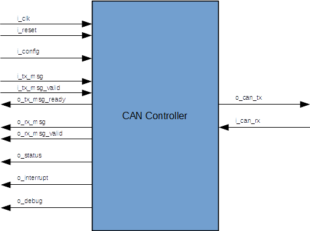

# CAN 2.0A/B Controller IP Core

## Overview

The noasic CAN Controller is a professionally developed IP core implemenenting both medium access (MAC) and physical layer
functions of the CAN bus protocol such as data encapsulation/decapsulation, frame coding
(stuffing/destuffing), medium access management, error detection, error signaling,
acknowledgment, serialization/deserialization, bit encoding/decoding, bit timing and synchronization.

## Features

* Implements the CAN protocol version 2.0A/B, ISO-11898-1
* Supports standard (11-bit) and extended (29-bit) identifiers
* Configurable data rate up to 1 Mbit/s
* Configurable timing parameters:
  - Prescaler factor (1..256)
  - Bit sampling time
* Built-in error handling & fault confinement
  - Receive and transmit error counters
  - Error active, error passive and bus-off states
  - Interrupt request lines for bit error, stuff error, CRC error, form error, ACK error, arbitration loss and overload frame reception
* Parallel Tx and Rx message interface with simple valid/ready handshake
* Test modes
  - Listen-only mode
  - Loopback mode for self-testing purposes

## Licensing

The CAN Controller IP Core is provided under the terms of the Apache License Version 2.0. Please [contact us](mailto:info@noasic.com) if you require a commercial license or additional consulting services for your project.

## Limitations

* The controller does not generate overload frames on its own, but responds to overload flags on the bus
* The controller does not perform automatic bit-rate detection. Bit-rate detection, if needed, must be performed in software using the controller's listen-only mode.
* No built-in sleep mode/wake up functionality
* No automatic re-start after bus-off (core must be reset)
* No support for message abortion

## I/O Interfaces

The following diagram shows the input and output interfaces of the CAN Controller Core.

### Clocking and Reset

| Name | Dir. | Type | Description |
| ---- | ---- | ---- | ----------- |
| `i_clk` | in | `std_logic` | System clock, e.g. 100 MHz |
| `i_reset` | in | `std_logic` | System reset (synchronous, active-high) |

### Configuration Interface

| Name | Dir. | Type | Description |
| ---- | ---- | ---- | ----------- |
| `i_config.prescaler` | in | `unsigned(7:0)` | Bitrate prescaler. Sets the  length of a time quantum (TQ) in system clock cycles. The actual length is `prescaler + 1`. |
| `i_config.tseg1` | in | `unsigned(3 downto 0)` | Time segment 1. Length of the first time segment in time quantums. The actual length is `tseg1 + 1`. The allowed range for `tseg1` is 1 to 15 (actual length: 2..16 TQs). |
| `i_config.tseg2` | in | `unsigned(2 downto 0)` | Time segment 2. Length of the second time segment in time quantums. The actual length is `tseg2 + 1`. The allowed range is 0 to 7 (actual length: 1..8 TQs) |
| `i_config.sjw` | in | `unsigned(1 downto 0)` | Synchronization jump width. The actual width is `sjw + 1`. The allowed range is 0 to 3 (actual jump width: 1..4 TQs) |
| `i_config.testmode` | in | `unsigned(1 downto 0)` | Test mode (0: normal operation, 1: listen-only mode, 2: loopback mode) |

### Transmit Interface

| Name | Dir. | Type | Description |
| ---- | ---- | ---- | ----------- |
| `i_tx_msg.data` | in | `std_logic_vector(63:0)` | Transmit message data (`[63:56]`: byte 0, `[7:0]`: byte 7) |
| `i_tx_msg.id` | in | `std_logic_vector(28:0)` | Message identifier (use only bits `[28:18]` for standard-length identifiers). |
| `i_tx_msg.dlc` | in | `unsigned(3:0)` | Data length code |
| `i_tx_msg.rtr` | in | `std_logic` | Remote transmission request flag |
| `i_tx_msg.ide` | in | `std_logic` | Extended identifier flag |
| `i_tx_msg_valid` | in | `std_logic` | Signals that the TX-message is valid, and that it can be transmitted. |
| `o_tx_msg_ready` | out | `std_logic` | Signals that the TX-message was transmitted successfully. |

### Receive Interface

| Name | Dir. | Type | Description |
| ---- | ---- | ---- | ----------- |
| `o_rx_msg.data` | out | `std_logic_vector(63:0)` | Receive message data (`[63:56]`: byte 0, `[7:0]`: byte 7) |
| `o_rx_msg.id` | out | `std_logic_vector(28:0)` | Message identifier (use only bits `[28:18]` for standard-length identifiers). |
| `o_rx_msg.dlc` | out | `unsigned(3:0)` | Data length code |
| `o_rx_msg.rtr` | out | `std_logic` | Remote transmission request flag |
| `o_rx_msg.ide` | out | `std_logic` | Extended identifier flag |
| `o_rx_msg_valid` | out | `std_logic` | Signals that the received message is valid (pulsed high for one clock cycle). |

### Status Interface

| Name | Dir. | Type | Description |
| ---- | ---- | ---- | ----------- |
| `o_status.error_state` | out | `unsigned(1:0)` | The CAN controller's error state (0: error active, 1: error passive, 2: bus off) |
| `o_status.rx_error_count` | out | `unsigned(7:0)` | Current value of the receive error counter |
| `o_status.tx_error_count` | out | `unsigned(8:0)` | Current value of the transmit error counter |

### Interrupt Interfaces

| Name | Dir. | Type | Description |
| ---- | ---- | ---- | ----------- |
| bit_error   | out | `std_logic` | Bit error |
| stuff_error | out | `std_logic` | Stuffing error |
| crc_error   | out | `std_logic` | CRC error |
| form_error  | out | `std_logic` | Form error |
| ack_error   | out | `std_logic` | Unacknowledged message |
| arb_loss    | out | `std_logic` | Arbitration lost while sending a| message |
| overload    | out | `std_logic` | Received an overload frame |

### Debug Interface

The debug interface provides information about the CAN Controller’s internal state.

| Name | Dir. | Type | Description |
| ---- | ---- | ---- | ----------- |
| `bsp_can_field`      | `out` | `t_can_field` | the currently transmitted/received CAN message field  |
| `bsp_can_field_slv`  | `out` | `std_logic_vector(4:0)` | std_logic_vector version of 'bsp_can_field'  |
| `bsp_transmitting`   | `out` | `std_logic` | signals that the CAN controller is currently transmitting |
| `bsp_receiving`      | `out` | `std_logic` | signals that the CAN controller is currently receiving |
| `bsp_stuff_bit`      | `out` | `std_logic` | signals that the current transmitted/received bit is a stuff bit |
| `bsp_bit_idx_u5`     | `out` | `std_logic_vector(4:0)` | index of the current bit within the current field (unsigned integer) |
| `bsp_byte_idx_u3`    | `out` | `std_logic_vector(2:0)` | index of the current data field byte (unsigned integer) |
| `btl_tx_clk`         | `out` | `std_logic` | the transmission clock-enable |
| `btl_rx_clk`         | `out` | `std_logic` | the reception clock-enable |
| `btl_resync`         | `out` | `std_logic` | signals a resynchronization event |
| `btl_phase_error_s6` | `out` | `std_logic_vector(5:0)` | the measured phase error (signed integer) |
| `btl_hard_sync`      | `out` | `std_logic` | signals a hard synchronization event |
| `quant_clk`          | `out` | `std_logic` | the quantum clock (generated by the prescaler) |
| `can_rx`             | `out` | `std_logic` | current level at the controller's CAN RX input |
| `can_tx`             | `out` | `std_logic` | current level at the controller's CAN TX output |

### CAN PHY Interface

| Name | Dir. | Type | Description |
| ---- | ---- | ---- | ----------- |
| `o_can_tx` | out | `std_logic` | CAN TX signal (to PHY) |
| `i_can_rx` | in | `std_logic` | CAN RX signal (from PHY) |

## Core Usage

`TODO`

### Bit Timing Configuration

`TODO`

### Message Transmission

`TODO`

### Message Reception

`TODO`

## Core Architecture

`TODO`

## Design Verification

`TODO`

## Implementation Results

`TODO`

## Acknowledgements

Thanks to Sigasi for providing a Sigasi Studio XPRT license, which was of great help for developing the core.
